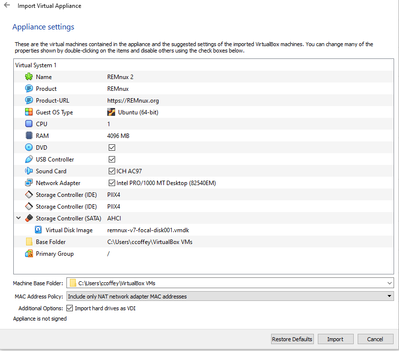
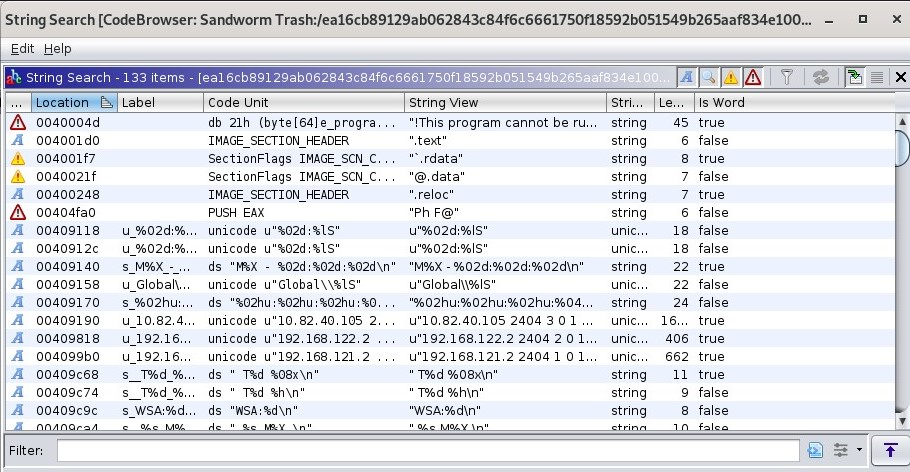
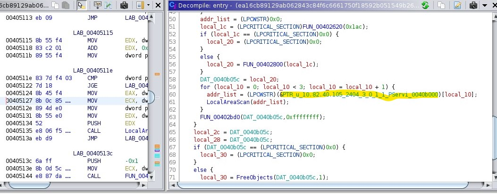
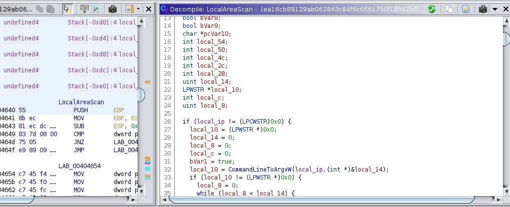
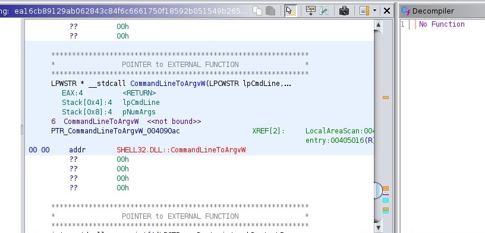
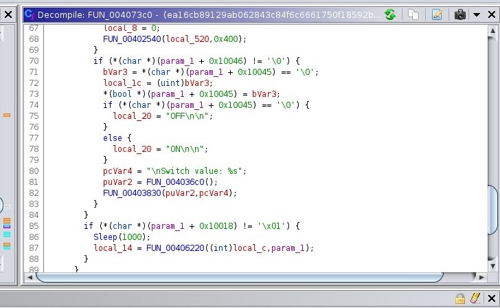

# An Intro to Analyzing Malware

Have you ever wanted to learn how to analyze malware, determine malware attribution, and learn more about how others defend against malware? Then this guide is for you!

Here is a list of specific topics covered in this guide:

- How to set up a Sandbox environment
- How to determine malware attribution
- What YARA rules are & how to make an effective YARA rule
- How to collect useful malware information for generating YARA rules
- AI applications in defending against malware

Please note that this guide assumes readers already have some baseline knowledge in C, Linux, virtual machines, and Ghidra. If you as a reader are unfamiliar with any of these topics, I suggest you look into them before reading more about this guide. I have a tutorial for how to use Ghidra [here](https://sites.google.com/view/ghidra-reverse-engineering/home#h.s1qs2m8gk4s9).

## Setting up a Sandboxed Environment

In order to safely and efficiently analyze our sample malware, we need to set up a **sandboxed environment**. A sandboxed environment is a virtual environment that allows you to safely run and analyze potentially malicious software, without risking damage to your host machine [7]. To set up a sandboxed environment, there are a few key steps you need to follow!

### Step 1: Install Oracle VirtualBox

For the purpose of this guide, we will be using VirtualBox. If you have already installed VirtualBox ***without Guest Additions****, you can skip this step (by default, installations do not come with Guest Additions).

If you haven’t installed VirtualBox already, you can do so [here](https://www.virtualbox.org/wiki/Downloads). You’ll want to install it on your host machine, so install the version that works with your host OS. Feel free to use the default installation settings, but do **not** install VirtualBox Guest Additions.*

**Make sure you do not install VirtualBox Guest Additions, as they could put your host machine at risk. If you have already installed them, you should uninstall VirtualBox and reinstall the program without Guest Additions. To check if you have installed them, run any virtual machine and use `Host Key + N` to get to performance settings. From there, select the Runtime Information Tab and view the Guest Additions information. If the guest additions are not installed, then it should report “Guest Additions: Not Detected”, otherwise they have been installed.* 

### Step 2: Install and Set Up REMnux

Next, we’ll download REMnux, a Linux toolkit for analyzing malware. We will download the VirtualBox OVA file from [here](https://docs.remnux.org/install-distro/get-virtual-appliance).

Once we have installed the OVA file, we’ll want to import it into VirtualBox. We can import it by opening the VirtualBox application and going to `File > Import Appliance` (Ctrl+i). 

From there, a window will launch that will look similar to the following (minus the base folder and the name). Feel free to keep these settings for now, the RAM usage should be okay. 



- Note: if it asks you to make a hard drive, feel free to make a Virtual Disk Image (VDI) of ~60GB. This can be dynamically sized, since we are only performing a static analysis.

Once you’re ready, click `Import` to start the import process. It should take a few minutes, so sit back and grab a coffee.  

After importing the file, we’ll want open the virtual machine by pressing `Start` to launch the window. The default credentials for sign-on is username: `remnux`, password: `malware`. After signing on, it’s good practice to change the credentials from their default setting.

### Step 3: Install Relevant Programs

After setting up REMnux, we’ll want to install the following programs onto our REMnux virtual machine:

- Ghidra
    - Follow the installation guide [here](https://sites.google.com/view/ghidra-reverse-engineering/home?authuser=0#h.4bs06m50ro54) to set up Ghidra for Linux distributions.
- VSCode or your favorite IDE
    - Install any extensions you want before moving onto the next steps!
    - VSCode is great for writing notes about the system, if you prefer to write notes in Markdown. We will also use it to create our very own YARA rule!
- p7zip
    - This will allow us to extract the malicious zip files with passwords!
    - You can install p7zip by running the command `sudo apt-get install p7zip-full`. It is not included in REMnux by default.
- yara
    - This will allow us to create and run our own YARA rules, which we’ll get into later! To install yara, run the command `sudo apt-get install yara`.
- OPTIONAL: Python (Any version >3.9) or the latest version of Java
    - This is optional, but useful for scripting with Ghidra. Ghidra supports custom Python or Java scripts to help with static malware analysis. We will not cover scripting in this guide.

Once you have installed these programs, you’ll be ready to move onto the next step!

### Step 4: Acquire the Malware

While we have internet access, we will want to download .zip files of malware samples from reputable sources. For the purpose of this guide, we will work with one sample of the **Industroyer** category of malware posted on MalwareBazaar. This malware class was created by Sandworm, Russia’s Military Intelligence Unit (Unit 74455) [8]. 

To download the Industroyer malware sample, click [here](https://bazaar.abuse.ch/download/ea16cb89129ab062843c84f6c6661750f18592b051549b265aaf834e100cd6fc/). You’ll want to click on the ‘download’ button to start the download process. Also, make sure you’re downloading it to your REMnux virtual machine. 

***Note: DO NOT UNZIP THE FILES YET (unless you want to ruin your host machine!)***

After downloading the Industroyer sample, we’ll want to download a benign malware .zip file sample from [here](https://www.eicar.org/download-anti-malware-testfile/). This will be our testing sample to see if our virtual machine is isolated (in terms of shared memory access) from our host.

### Step 5: Isolate REMnux from the Host

Last but not least, we will want to isolate our virtual machine. Our goal is to remove network access, function sharing, and any shared folders between our virtual machine and our host. It’s critical that these steps are fully completed, as otherwise we are risking our entire device and potentially other devices on the network.

Just as a fun note, [there is malware that can “escape” virtual machines and infect the host.](https://www.techrepublic.com/article/10-new-vm-escape-vulnerabilities-discovered-in-virtualbox/) On VirtualBox, usually malware will attempt to take advantage of a few known vulnerabilities. 

***Note: This is an important step to follow! Failure to follow this step could result in serious damage to your device.*** 

To isolate the REMnux virtual machine:

- Change the `Devices > Shared Clipboard > Disabled` setting to disable shared clipboard access, then click OK.
- Change the `Devices > Drag and Drop > Disabled` setting to disable drag and drop access, then click OK.
- Remove any shared folders under `Devices > Shared Folders` (by default, there are none).
- Check if VirtualBox Guest Additions are enabled by going to performance settings (`Host Key + N`). From there, select the `Runtime Information Tab` and view the Guest Additions information. If the guest additions are not installed, then it should report “Guest Additions: Not Detected”. If these additions have been installed for any reason, you will want to uninstall them. The easiest way to do so, unfortunately, is to uninstall VirtualBox and reinstall it without them.
- Go to `Devices > Network > Network Settings` , then alter the adapter in use (most likely Adapter 1) and change its “Attached to” setting to `Not attached`, then click OK. Here is a picture of this setting for reference:


To verify that your virtual machine is properly isolated, you’ll first want to test if your virtual machine is not connected to any network. You can do this by simply opening a web browser and checking if you can access the internet.

Next, you’ll want to test if clipboard access has properly been disabled. The easiest way to check is if you can copy something from your virtual machine and paste it to your host machine. 

Last but not least, we will run some sample code that will trigger any anti-virus software installed on our host machine if there is shared memory between the virtual machine and the host machine. You can unzip the file by using `cd name/to/file/location` to get to the file location (replace path with location) using `7z x eicar_com.zip` to unzip the file. 

- If you get to a prompt that asks you to respond with yes, no, skip all, or quit, respond with ‘(s)kip all’.

If any of these checks have failed, go back to the beginning of step 5 and make sure all these settings are correct. *If all of them are set to what they should be, then these checks should pass.* 

### Step 6: Release the Kraken!

Assuming you have set up all the other steps correctly, you should be good to go!

- To unzip the malicious sample code, simply run the command `7z x ea16cb89129ab062843c84f6c6661750f18592b051549b265aaf834e100cd6fc.zip -pinfected`. Remember, the tab key is your friend here (filling in the rest of the file name is super helpful in this case, considering that clipboard access is disabled!).
    - If you get to a prompt that asks you to respond with yes, no, skip all, or quit, respond with ‘(s)kip all’, just like last time!

Now you’ll be ready to perform a static analysis with Ghidra!

## A Brief Overview of Industroyer

Before we get into a static malware analysis of our Industroyer sample, it’s important note some basic information about the **Industroyer** class of malware. 

Industroyer (also known as CRASHOVERRIDE) is a sophisticated malware class that was discovered in 2016. As mentioned earlier, it was created by Sandworm, also known as Russia’s GRU 74455 Military Intelligence Unit [8]. The FBI indicted six members of the group due to their connection to multiple attacks that have not just damaged Ukrainian critical infrastructure, but also American/EU/South Korean companies (think of NotPetya, the 2018 Winter Olympic Games cyber attack, etc.). 

After its initial release, the malware gained significant attention by security researchers due to its capability to cause disruptive and potentially destructive effects on electrical grids. It is specifically designed to target industrial control systems (ICS) used in power grids by targeting four commonly-used IEC protocols in electricity distribution infrastructure [3]. It overwrites firmware in ICS systems to control switches, circuit breakers, and other components of the electrical grid. Then, the malware creates multiple back-doors and command & control (C2) servers to allow attackers to issue commands remotely to disrupt the operation of critical infrastructure. Its first known use case was a cyber attack that caused a widespread power outage in Ukraine in December 2016 [4]. 

Sounds scary, right? The good news is that malware researchers have already spent multiple months analyzing this class of malware, so we know that it is safe to perform a static analysis on it in our sandboxed environment. It’s important though to double-check, even *triple-check*, that we’ve set it up correctly!

If you’d like to learn more about Industroyer, or more about Sandworm in general, you can check out these resources:

- [https://www.wired.com/story/russia-ukraine-cyberattack-power-grid-blackout-destruction/](https://www.wired.com/story/russia-ukraine-cyberattack-power-grid-blackout-destruction/)
- [https://www.welivesecurity.com/wp-content/uploads/2017/06/Win32_Industroyer.pdf](https://www.welivesecurity.com/wp-content/uploads/2017/06/Win32_Industroyer.pdf)
- [https://attack.mitre.org/groups/G0034/](https://attack.mitre.org/groups/G0034/)

## Analyzing Malware Effectively

It’s important to know more about the importance of running a static analysis before we get into doing it. In this section, we’ll cover the differences between a static vs. dynamic malware analysis, common goals of a static analysis, and what information is useful.

### Static vs. Dynamic Malware Analysis

Static analysis is an key component in malware analysis. It involves examining the code and file structure of malicious software to gain insights into its behavior, capabilities, and potential impact [2]. *It does not involve executing the malware.* By conducting a surface-level analysis of the malware, we can identify patterns, see how the malware might function, and gather evidence to determine culpability. 

Dynamic malware analysis, on the other hand, involves executing the malware. For the purpose of this guide, we will not cover dynamic analysis, but it is usually done after a static analysis. It is helpful for providing a deeper understanding of the malware's runtime behavior and interaction with the system [2].

The downside of performing just a static analysis is that it provides limited insight into the dynamic behavior of the malware, which can negatively affect our understanding of the malware’s functionality [2]. However, a dynamic analysis also requires a lot more time and setup (as many malware variants will avoid running in a virtual machine). 

### Static Analysis Goals

For the purpose of this guide, we’ll focus on the following goals during our static analysis:

- Identification of the malware & building **YARA** (Yet Another Recursive Acronym) rules for defense purposes
    - We will talk more about YARA rules later in this guide. Long story short, they are widely used in the cybersecurity community to help users defend against new forms of malware and are commonly used in many anti-virus programs.
- Trying to understand the basics of the malware functionality for defense purposes
    - A static analysis can help with this, but as mentioned earlier, a dynamic analysis is far better at understanding how the malware functions.
- Gathering evidence to determine malware attribution
    - This is usually done overtime with multiple malware samples, as it can paint a better picture of how the malware operates.

### So What Information is Useful?

There is a lot of confusion in the beginning on what information is considered *useful*. After all, analyzing malware can give us a lot of information! It’s important to know how to sift through this information, and what information can be useful for later. 

As talked about earlier, two main goals in performing a static analysis are determining the malware attribution and gathering information for defending against the new malware. 

- For gathering information for defense purposes (such as creating YARA rules), strings, hashes, etc. are more sought after as they provide they provide specific and easily recognizable attributes that can be used to identify the presence of known malware or malicious patterns [1]. Many of these attributes (particularly hashes and strings) change overtime, however, which is something to keep in mind when analyzing new malware.
- On the other hand, for determining malware attribution, the tactics, techniques, and procedures (**TTPs**) are far more valuable in the long-run (e.g. methods used to gain unauthorized access, distribute malware, interact with command-and-control infrastructure, etc.). The TTPs play a crucial role in determining culpability, as these attributes are much more difficult to change and remain persistent in most malware versions [5]. Attribution involves gathering evidence, conducting forensic analysis, and building a case against the perpetrators, so having evidence that remains persistent is key.*
    - **As a side note, sometimes time stamps of when commands were executed in addition to logs of an attack can help determine attribution.*

It's also worth noting that YARA rules and TTP-based attribution are *not* mutually exclusive. They complement each other in the overall cybersecurity landscape [5]. YARA rules help in rapid detection and identification of known malware, while TTP-based attribution contributes to understanding the broader threat landscape, tracking threat actors, and building cases against them. In some cases, for example, as the malware “evolves” overtime (i.e. changes in their IP address/domain names), patterns can be recognized such as their location, their server ownership route, etc.

## Defending Against Malware with YARA Rules

Now that we’ve covered what information is useful, we can highlight some key information about YARA rules. We’ll want to know more about how they work, especially if we’re going to use them!

### What are YARA Rules?

YARA (Yet Another Recursive Acronym) is an open-source pattern-matching tool for malware researchers. YARA rules can be written manually or generated using tools that analyze malware samples or known indicators of compromise [1]. They can be used with various security platforms to scan files, memory, or network traffic for matches against the defined rules, aiding in malware detection.

The development of YARA began around the mid-2000s when Victor Manuel Alvarez recognized the need for a flexible and efficient tool to identify and classify malware samples [6]. The initial version of YARA was released in 2007 as an open-source project. It gained popularity within the cybersecurity community due to its effectiveness and ease of use, allowing security researchers to create their own rules and signatures to detect specific malware families, variants, or patterns of interest.

The rules consist of two main components: a set of strings and other identifying information, and a set of conditions that it must meet for the YARA rule to run. The conditions define the characteristics or patterns to be matched, typically based on strings, regular expressions, or binary sequences, but it can also target various attributes of a file, such as file names, sizes, hashes, headers, or specific content patterns. There is also an optional, but highly-encouraged-to-add metadata section that helps malware researchers identify ownership of the rule. 

Below is an example YARA rule, which targets the eicar.com example malware that we downloaded onto our virtual machine: 

```c
/* Filename: eicar.yar */

rule eicar{
	meta: /* It's optional but highly recommended to have a meta section */
		author = "Caitlin Coffey"
		/* Author first name and last name */
		description = "Testing YARA rules for eicar anti-virus testing software" 
		/* Brief description of the YARA rule and its applications */
		hash = "" 
		/* The hash of the file should ideally be included for reference, but it is not required. */
	strings: 
		/* These strings are found in eicar.com, via running strings eicar.com in the bash cl. */
		$a = "$EICAR-STANDARD-ANTIVIRUS-TEST-FILE!$H+H*"
		$b = "X50!P%@AP"
	condition:
		/* Confirms both strings must be in the file for the YARA rule to trigger. */
		( $a and $b )
}
```

If we were to run the file using `yara eicar.yar ./` in the directory containing `eicar_com.zip` and `eicar.com`, we would get the following output:


This output shows us that it can pick up three files with the string: our file we just made (eicar.yar), eicar_com.zip, and eicar.com. This is what we are looking for, since we want it to pick up the eicar.com file (and its extensions).

### Creating Effective YARA Rules

Now that we’ve shown an example YARA rule, we’ll dive into more about how to create an effective YARA rule. When we perform a static analysis, we’ll want to make sure we gather enough information for creating effective YARA rules, as it will help us create a rule that flags the malware, but not the other legitimate processes. 

In general, effective YARA rules usually contain the following attributes [1]:

- Specificity: Effective YARA rules are specific to the targeted malware. They focus on unique indicators or patterns that are unlikely to be found in legitimate files or benign software. Being too generic may lead to false positives, where legitimate files are mistakenly flagged as malware.
- Relevance: Effective YARA rules target indicators that are directly related to the functionality of the malware. They identify significant artifacts such as specific strings, file names, function names, or network traffic patterns associated with the malware's operations.
- Adaptability: Effective YARA rules are designed to accommodate variations or evasive techniques employed by malware. They may incorporate regular expressions or wildcard operators to capture dynamic or obfuscated indicators, allowing the rule to match different variants or versions of the malware.
- Context: Effective YARA rules may take contextual factors into account, such as file sizes, file extensions, specific sections, or imported libraries.

Below is a good example of a YARA rule targeting the Industroyer malware class [9]:

```c
rule Industroyer_Malware_1 {
   meta:
      description = "Detects Industroyer related malware"
      author = "Florian Roth"
      reference = "https://goo.gl/x81cSy"
      date = "2017-06-13"
      hash1 = "ad23c7930dae02de1ea3c6836091b5fb3c62a89bf2bcfb83b4b39ede15904910"
      hash2 = "018eb62e174efdcdb3af011d34b0bf2284ed1a803718fba6edffe5bc0b446b81"
   strings:
      $s1 = "haslo.exe" fullword ascii
      $s2 = "SYSTEM\\CurrentControlSet\\Services\\%ls" fullword wide
      $s3 = "SYS_BASCON.COM" fullword wide
      $s4 = "*.pcmt" fullword wide
      $s5 = "*.pcmi" fullword wide
      $x1 = { 00 53 00 65 00 72 00 76 00 69 00 63 00 65 00 73
         00 5C 00 25 00 6C 00 73 00 00 00 49 00 6D 00 61
         00 67 00 65 00 50 00 61 00 74 00 68 00 00 00 43
         00 3A 00 5C 00 00 00 44 00 3A 00 5C 00 00 00 45
         00 3A 00 5C 00 00 00 }
      $x2 = "haslo.dat\x00Crash"
   condition:
      ( uint16(0) == 0x5a4d and filesize < 200KB and 1 of ($x*) or 2 of them )
}
```

It contains enough specific strings to maintain its specificity in addition to targeting the function of the malware (particularly with `haslo.dat\x00Crash`). It also takes some important context to account: the file size of the malicious script. This is because strings such as `SYSTEM\\CurrentControlSet\\Services\\%ls` could be used in legitimate, albeit much larger, system programs. The file size limiter attempts to negate that issue by focusing on smaller file sizes. 

Last but not least, it uses conditional operations and a wildcard for the $x* variables to maintain its flexibility. As a result of this, it is capable of catching and labeling *most* Industroyer-related malware. 

A non-effective YARA rule can be similar in appearance, but its rules will be lacking in one of the following categories listed. Its weak rules can cause some legitimate processes to be flagged as malware, or even worse, allow malware to evade detection all-together [1]. Ultimately, effective YARA rules are flexible enough to not falsely flag legitimate processes while also being specific enough to catch malicious code.

## Performing a Static Analysis

Now that we’ve covered the basics of static vs. dynamic malware analysis, YARA rule making, and finding relevant information for defense and attribution, we can start analyzing our awesome Industroyer malware sample!

### Using Bash Command-Line Tools

The first step we’ll want to do is use bash command line tools to get an initial check on what this program might look like. Some of the most helpful command line tools to do this include `strings` and `hexdump`. Here is what running the `strings ea16cb89129ab062843c84f6c6661750f18592b051549b265aaf834e100cd6fc.exe`  command will show us in the terminal:


As one can see, there are a few strings that seem to be referencing Windows processes and libraries. We can get a sense that its target system in this case is Windows. It will be good to remember these strings for later as we can try to figure out where they are called in Ghidra. This is because if the malware sample is using these Windows processes, it will help us understand how the malware is able to function; if the malware is not using these processes, it can help us figure out what legitimate processes it might be trying to mask as. 

### Importing the Executable to Ghidra

After getting an initial sense of the program’s function through calling `strings` , we can now import the executable into Ghidra. Once you import the executable, open the CodeBrowser window and let Ghidra run the initial analysis. 

First, we can look back at the strings in memory to see where they are called by going to `Search > For Strings`. For this search, keep the default settings Ghidra provides and hit ‘Search’. Here are the results from my search: 



Ghidra in this case was actually able to pick up more strings than the bash command, and we can see a few local IP addresses listed as strings. These IP addresses could indicate that the malware is looking for specific devices in the local network.

If we go to where the IP address string `u"10.82.40.105 ..."` is called, we can see that it is referenced in the `entry` function, the function that first starts running in the program:

 



Note that the function names are estimates of what the capability might be—we don’t know yet what this program is doing! But we can see that it indexes this space in memory by `local_10`, which gives us an output to `addr_list` (it is unclear if it is actually a list—we’ll leave that untouched for now). 

If we go to the function call that takes `addr_list` below the line that references the highlighted address in memory, we can see a few more things:



It appears it takes the argument of what is being passed (named `local_ip` for simplicity’s sake), check if it is valid (or non-null), then it passes it to `CommandLineToArgvW`. From there, the output of `CommandLineToArgvW` is checked to see if its output is valid/non-null, and the program moves forward. 

Now, what’s interesting here is that you can see if you try to click on `CommandLineToArgvW`, Ghidra tells us that it’s an external function found in `SHELL32.DLL`. We can see from here that at the very least, this class of malware is calling Windows 32 system libraries. 



This lines up with what security researchers have found—we have learned more about the processes the malware is using! [3]

Another similarity between our program and what malware researchers were able to find is the creation of the log file from the 104 payload. The 104 payload attempts to switch the controller ON or OFF, and we conveniently have those strings in memory in our more recent malware sample. If we go to where the strings are referenced, we can see they are referenced here in `FUN_004073c0`:



Compared to the [whitepaper on the Industroyer malware (authored by ESET)](https://www.welivesecurity.com/wp-content/uploads/2017/06/Win32_Industroyer.pdf), we can see clear examples of the log file produced by the 104 payload that line up with what we have [3]:


We can see that even though the strings have changed since the initial malware release in 2016, we have still found the function that is writing part of the packet that is being produced by the 104 payload! This aligns with what we have learned about tactics, techniques, and procedures—these remain consistent as they are harder for the adversary to change. In terms of determining attribution, this is important to keep in mind!

## Making an Effective YARA Rule

So now that we’ve seen how Industroyer works, we can find and collect some data for our YARA rule that is 1. specific, 2. adaptable, 3. relevant, and 4. contextual. 

### Creating Our First YARA Rule

Just like the example outlined in the ‘Creating Effective YARA Rules’ section, we’ll want to first create an outline of the YARA rule with metadata included. You can open your favorite IDE to do this (my preference is VSCode). The outlined YARA rule should look something like this:

```c
rule Industroyer{
	meta:
		author = "Caitlin Coffey"
		description = "Detecting Industroyer-related malware and its subclasses"
		date = "2023-05-03"
		hash = "" 

	strings: 
		
	condition:
		
}
```

First, we’ll want to fill in the hash value for the metadata section. MD5 hashes will work just fine for this. We can generate a SHA256 hash of the executable file by running the following command (assuming one is in the same directory as the malware sample executable file): `sha256sum ea16cb89129ab062843c84f6c6661750f18592b051549b265aaf834e100cd6fc.exe > res.sha256` . Our hash will be stored in `res.sha256`. 

Once we have the hash, simply copy and paste the hash value into ‘hash’ portion of the metadata section. Now, if a security researcher wants to confirm that their malware sample has been modified, they can verify their sample file against our provided hash!

Next, we’ll want to fill in our strings section. We’ll want to grab some strings that are unique to the file that aren’t likely to be part of other legitimate processes. This will involve some “guessing and checking”, but some obvious contenders here would be some of the strings used in the 104 packet logging, namely `OFF`, `Switch value`, and `Connection closed`. We can include all three of them for now in our strings list, but these strings might change in the future. Now, our YARA rule should look like this:

```c
rule Industroyer{
	meta:
		author = "Caitlin Coffey"
		description = "Detecting Industroyer-related malware and its subclasses"
		date = "2023-05-03" 
		hash = "ea16cb89129ab062843c84f6c6661750f18592b051549b265aaf834e100cd6fc" 

	strings: 
		$s1 = "OFF"
		$s2 = "Switch value"
		$s3 = "Connection closed"

	condition:
		
}
```

Last but not least, we can specify our condition. We could simply check if the file contains all the strings, but what if we also checked the file size? We can check the file size by running `du -h ea16cb89129ab062843c84f6c6661750f18592b051549b265aaf834e100cd6fc.exe` in the command terminal (once again, this assumes one is in the same directory as the malware sample executable file). As of May 2023, the file size appears to be ~40KB. We can see that for previous Industroyer YARA rules, such as the one linked in the “Creating Effective YARA Rules” section, the condition is set to look at files smaller than 200KB, which our current file would fall under. This is a good sign that 200KB is a good size to add to the conditions list!

However, what should we do with our strings? For now, we can require all files to contain all three strings before they are flagged by our YARA rule. As mentioned earlier, this might not be good later on, but it’s important to try different combinations of strings to find the best match. Let’s try it! 

```c
/* Filename = industroyer.yar */
rule Industroyer{
	meta:
		author = "Caitlin Coffey"
		description = "Detecting Industroyer-related malware and its subclasses"
		date = "2023-05-03" 
		hash = "ea16cb89129ab062843c84f6c6661750f18592b051549b265aaf834e100cd6fc" 

	strings: 
		$s1 = "OFF"
		$s2 = "Switch value"
		$s3 = "Connection closed"

	condition:
		( filesize < 200KB and all of ($s*) )
}
```

### Testing the YARA Rule

We can test our newly created YARA rule by running `yara industroyer.yar ./` in the directory containing the `industroyer.yar` file. 


If you get this output, then the YARA rule works as it should! If it’s not flagging the malware sample executable file, the best option is to try different strings that belong to critical (yet specific) malware functions. This could mean using different strings for the logging feature, or using IP addresses. It will be a lot of trial-and-error!

Making a working YARA rule is no small feat, so congrats reader!

## Static Malware Analysis Conclusions

With a few steps, we’ve already been able to find a lot of interesting information about the malware. We were able to find more information about how it works (namely what processes it might be legitimately using), what strings/hashes would be useful for building a YARA rule for defense purposes, and we even saw how part of the packet structure has remained consistent between the 2016 initial release and the new 2022 malware sample (which is helpful for building a case for determining attribution). 

With your new-found knowledge in performing a static malware analysis, you can explore the world of malware research! Malware researchers regularly perform static analyses on acquired malware samples, since as we have seen, they are quite effective for what they provide. 

# References

1. Arntz, Pieter. “Explained: Yara Rules.” *Malwarebytes*, Malwarebytes Labs, 15 Sept. 2017, https://www.malwarebytes.com/blog/news/2017/09/explained-yara-rules.
2. Baker, Kurt. “Malware Analysis: Steps & Examples.” *CrowdStrike*, CrowdStrike, 17 Apr. 2023, https://www.crowdstrike.com/cybersecurity-101/malware/malware-analysis/.
3. Cherepanov, Anton. “WIN32/Industroyer - A New Threat for Industrial Control Systems.” *Welivesecurity*, ESET, 12 June 2017, https://www.welivesecurity.com/wp-content/uploads/2017/06/Win32_Industroyer.pdf.
4. Greenberg, Andy. “New Clues Show How Russia's Grid Hackers Aimed for Physical Destruction.” *Wired*, Conde Nast, 12 Sept. 2019, https://www.wired.com/story/russia-ukraine-cyberattack-power-grid-blackout-destruction/.
5. Herbert, Lin. “Attribution of Malicious Cyber Incidents.” *Hoover Institution*, Hoover Institution at Standford University, 2016, https://www.hoover.org/sites/default/files/research/docs/lin_webready.pdf.
6. Roca, Tiffany. “Yara Rules: The Basics.” *IBM Security*, IBM, 19 May 2021, https://community.ibm.com/community/user/security/blogs/tiffany-roca1/2021/05/19/yara-rules-the-basics.
7. “Sandbox (Computer Security).” *Wikipedia*, Wikimedia Foundation, 26 Apr. 2023, https://en.wikipedia.org/wiki/Sandbox_(computer_security).
8. “Six Russian GRU Officers Charged in Connection with Worldwide Deployment of Destructive Malware and Other Disruptive Actions in Cyberspace.” *The United States Department of Justice*, U.S. Department of Justice Office of Public Affairs, 13 July 2022, https://www.justice.gov/opa/pr/six-russian-gru-officers-charged-connection-worldwide-deployment-destructive-malware-and.
9. Yara-Rules. “Yara Rule Set - Identifier: Industroyer.” *GitHub*, Yara-Rules, 14 June 2017, https://github.com/Yara-Rules/rules/blob/master/malware/APT_Industroyer.yar.
